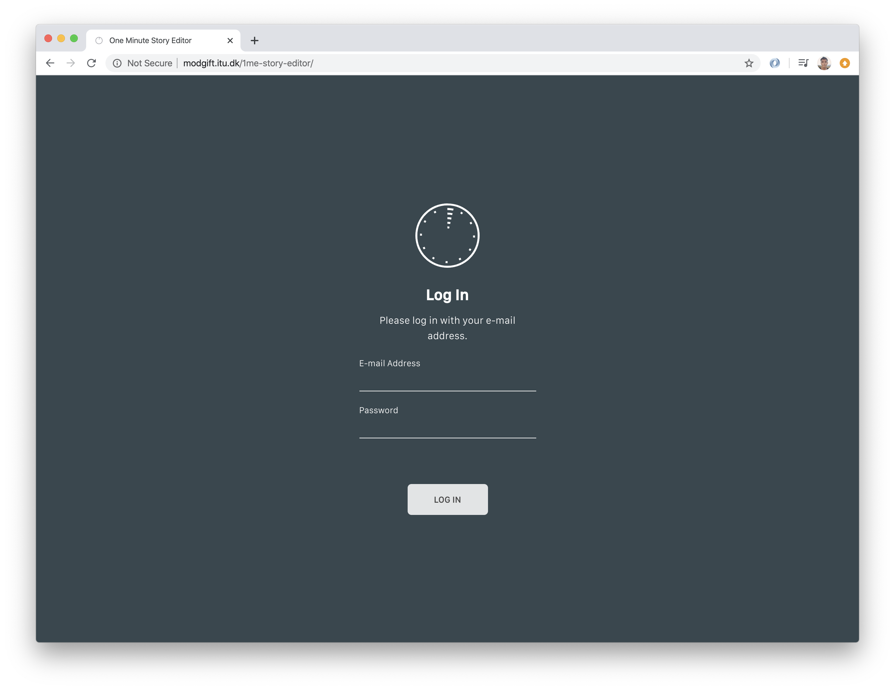
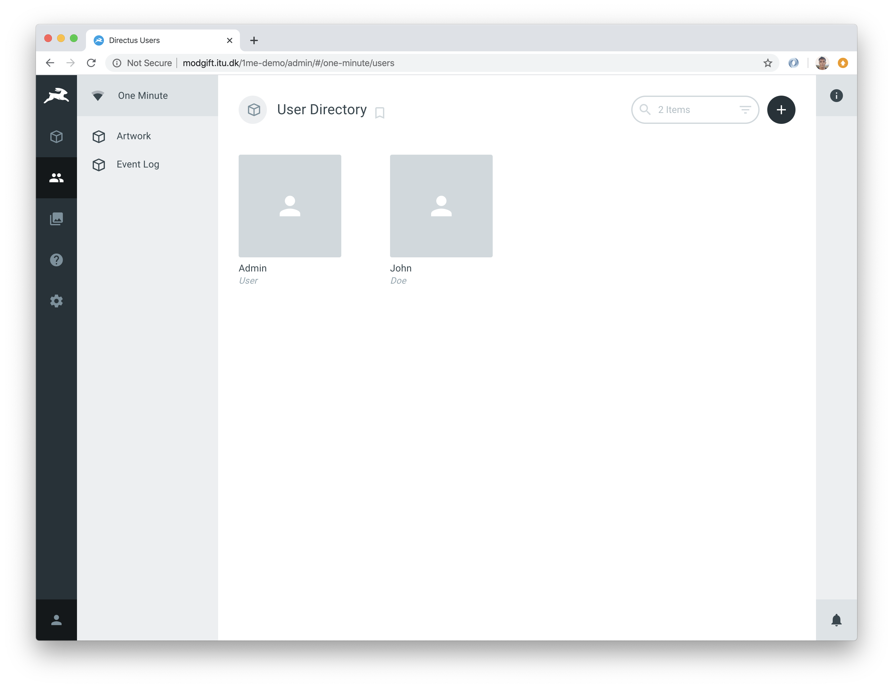

# One Minute: Setup, Installation and Customisation

The One Minute Experience allows visitors to read bite-sized stories about the objects they see within the museum. Visitors can read stories by simply scanning an object with their camera. It is also possible to create these stories using a specialised story editor tool: allowing anyone to create accessible, yet engaging stories about the objects in your museum.

## The One Minute Project

The One Minute project consists of four parts.

- [The One Minute Experience Mobile App](https://github.com/twray/One-Minute-Experience-Mobile-App).
- [The One Minute Experience Story Editor](https://github.com/twray/One-Minute-Experience-Story-Editor).
- A web server running the [Directus Headless CMS](https://directus.io/) with the [One Minute Experience Extension](https://github.com/xmacex/OneMinuteExperienceApiV2) installed.
- A [Microsoft Azure CustomVision Account](https://www.customvision.ai/) with an active Multi-class Classification project, with active API keys for both training and prediction.

This guide will detail how you can set up, install and customise One Minute for your museum.

## Set Up Your CustomVision Account and Get Your API Keys

One Minute uses Microsoft's CustomVision service to perform its image recognition capabilities. In order to setup One Minute for your museum, you will first need to create and configure a CustomVision account. You will then need to obtain a set of API keys so you can connect the Mobile App and Story Editor to this account.

### Create a CustomVision Account

Microsoft offers free and paid subscriptions for this service. The free service allows you to store a limited number of artworks, although if you wish to try or demonstrate the tool on a relatively small collection, the free service is sufficient. The paid subscription offers much more generous capacity in terms of how many images are stored, and the amount of transactions that the system allows.

You can [view pricing information and the differences between a free and a paid CustomVision account](https://azure.microsoft.com/en-us/pricing/details/cognitive-services/custom-vision-service/).

In the following steps. We will set up a free CustomVision account, and create a CustomVision project. We will then later 'link' this project to the One Minute Story Editor and Visitor App. If you wish to do so, you can always upgrade this account to a paid account at a later point.

1. Go to the [Microsoft CustomVision home page](https://www.customvision.ai/).

2. Click on the 'Sign In' link. You'll be prompted to either sign in with an existing Microsoft account, or you will be prompted to create a new one.

3. Once signed in, you may be prompted to create an Microsoft Azure subscription. CustomVision is a service offered by Microsoft Azure, so you would need to sign in or create an Azure account to continue. You will need to add Credit Card information in order to create an Azure account, although you would not be charged anything unless you opt for technical support or a paid subscription.

4. If you were prompted to create an Azure account, go back to [Microsoft CustomVision home page](https://www.customvision.ai/) and click on the 'Sign In' link if it is still present. At this point, you should see a blank 'Projects' screen.


### Create our CustomVision Resources

Once you have set up a CustomVision account, you would need to create your *resources*.

Think of a resource as a 'job': something that a service offers. In our case, we would like our CustomVision service to train our images so we can add artworks and stories to the prediction model. Likewise, when a visitor takes a photo with the Visitor App, we would like CustomVision to see if this photo matches any of the artworks we have within the CustomVision model. Hence, we would like CustomVision to 'predict' the image. Since we are asking CustomVision to train and predict images, we would need to create a *training resource* and a *prediction resource*, and assign these two resources to a *resource group*.

1. When logged in to CustomVision and you see the 'Projects' screen, click on the gear icon in the top right corner of the screen.

2. Next to the 'Resources' link, click 'create new'.

3. First we'll create our training resource. Enter a resource name (e.g. `1ME_Training`), select your 'Pay-As-You-Go' subscription,

4. If you haven't done so already, create a Resource Group. Next to 'Resource Group', click 'Add New', and give it a name (e.g. `1ME_Resource_Group`). Select the location that is closest to you.

5. Under the 'Kind' dropdown menu, select `CustomVision.Training`, and select the location that is closest to you.

6. Under the 'Pricing Tier' dropdown, select `F0`. This is the free pricing tier.

Now that we have created our training resource, we will now follow the exact same steps to create our prediction resource.

1. Again, we're going to create a new resource by clicking on the 'create new' link.

2. Enter a resource name (e.g. `1ME_Prediction`), select your 'Pay-As-You-Go' subscription.

3. Select the resource group you have just created.

4. Under the 'Kind' dropdown menu, select `CustomVision.Prediction`, and select the location that is closest to you.

5. Under the 'Pricing Tier' dropdown, select `F0`. This is the free pricing tier.

By now you should habe both a *training resource* and a *prediction resource* set up. Your screen should appear as follows:


Click on each box to view more information about each resource. You'll notice that both of our training and prediction resources have a set of keys associated with them. Namely, each resource has a **Key**, **Endpoint** and **Resource Id**.

We'll need to note down this information, as we will need these keys to 'connect' the One Minute Story Editor and Visitor App to the CustomVision service.

If it is not expanded already, click on the training resource box to expand it.

Now create a text file `keys.txt`, and copy and paste the **Key**, **Endpoint** and **Resource Id** listings into the file as follows:

```
TRAINING_KEY=[your-training-key]
TRAINING_ENDPOINT=[your-training-endpoint]
TRAINING_RESOURCE_ID=[your-training-resource-id]
```

Of course, replace `[your-training-key]`, `[your-training-endpoint]` and `[your-training-resource-id]` with the actual values within the grey boxes under the **Key**, **Endpoint** and **Resource Id** headings, respectively.

Now we'll do the same and note down our keys for the prediction resource. If you haven't done so already, expand the information box for the prediction resource and note down its **Key**, **Endpoint** and **Resource Id** in the following format. Add these entries to your `keys.txt` file.

```
PREDICTION_KEY=[your-prediction-key]
PREDICTION_ENDPOINT=[your-prediction-endpoint]
PREDICTION_RESOURCE_ID=[your-prediction-resource-id]
```

Save your `keys.txt` file.

We now have our training and prediction resources ready, and we also have the necessary keys to connect One Minute to these resources. The final step is to now create a *project*.

### Create our CustomVision Project

Within the context of CustomVision, a *project* represents a single image prediction model, with its own set of images. In essence, a CustomVision project is where the images are actually stored. If you are a large organisation with multiple collections, you would typically setup one project per collection.

In order for One Minute to work, you will need at least one CustomVision project. Let's set up a project now.

1. Click on the 'Eye' icon in the top-left corner to navigate back to the Projects page.

2. Click on 'New Project'.

3. Enter a project name (e.g. `1ME`). You can optionally enter a description. Your training resource should be automatically selected. If not, you will either need to manually select it in the dropdown, or you will need to click on the 'create new' link and follow the above steps to create a training resource.

4. For the 'Project Types' option, select 'Classification'.

5. For the 'Classification Types' option, select 'Multiclass'.

6. For the 'Domains' option, select 'General'.

7. Once done, click on 'Create Project'.

You've now created a CustomVision project. Once you have navigated into the project, you should be presented with a screen that looks something like this.


This project represents the container that will store our images and prediction model. Within this project, click on the gear icon located at the top-right corner of the screen. You should come to a screen that looks like this:


On the left-hand side of this screen, there is a **Project Id** field. Copy the text from this field, and add it to our `keys.txt` file:

```

PROJECT_ID=[your-project-id]

```

We have now set up our CustomVision account and have created our resources and projects. We have now extracted everything we need to 'connect' One Minute to CustomVision. The following is an anonymised sample of what your `keys.txt` file could look like.

```

TRAINING_KEY=xxxxxxxxxxxxxxxxxxxxxxxxxxx7d249
TRAINING_ENDPOINT=https://xxxxxxxxxxx.api.cognitive.microsoft.com/
TRAINING_RESOURCE_ID=/subscriptions/xxxxxxxx-xxxx-xxxx-xxxx-a897a03b5efd/resourceGroups/1ME_Resource_Group/providers/Microsoft.CognitiveServices/accounts/1ME_Training

PREDICTION_KEY=xxxxxxxxxxxxxxxxxxxxxxxxxxxd0478
PREDICTION_ENDPOINT=https://xxxxxxxxxxx.api.cognitive.microsoft.com/
PREDICTION_RESOURCE_ID=/subscriptions/xxxxxxxx-xxxx-xxxx-xxxx-a897a03b5efd/resourceGroups/1ME_Resource_Group/providers/Microsoft.CognitiveServices/accounts/1ME_Prediction

PROJECT_ID=xxxxxxxx-xxxx-xxxx-xxxx-xxxxxxxx3833

```

Note that in the above sample, some of the keys and IDs are blanked out. This is intentional - your `keys.txt` file will look different. If your `keys.txt` resembles the above sample, then you are ready to move on to the next step.

## Set Up the Directus CMS and Install the One Minute Extension

Once the CustomVision account is set up, we can now install the Directus CMS. The CMS is responsible for storing the stories, image files and other pieces of metadata for One Minute. It also provides a way for us create and manage user accounts for the One Minute Story Editor.

The [Directus CMS](https://directus.io/) is described as a [headless CMS](https://en.wikipedia.org/wiki/Headless_content_management_system). It wraps SQL databases with an easy-to-use administration interface, and provides a convenient API for accessing and modifying its data. When stories are added and edited using the Story Editor, they are stored within this CMS. The CMS also communicates with the CustomVision API so that there is link between the images stored within CustomVision and the artworks stored within the CMS.

The Directus CMS wraps a MySQL database: both of which are installed on a server. This part of the set up process assumes that you have access to a server with MySQL and PHP installed.

### Technical Requirements

Before you continue, we'll need to make sure that:

- You have access to access to a Web Server with MySQL installed. The common [LAMP](https://en.wikipedia.org/wiki/LAMP_(software_bundle)) installation should be sufficient. You can [view more information about the requirements here](https://docs.directus.io/installation/git.html#step-1-make-sure-requirements-are-met).

- That you have sufficient access privileges on the server to:

  - Create and manage MySQL databases. For this, you would need a MySQL username and password.

  - Clone and/or add new folders and files into a server's `/var/www` or `/public_html` (or similar) folders. The Directus API, which is used by the One Minute Story Editor and Visitor App to communicate with the CMS, resides here.

Please note that it is beyond the scope of this guide to discuss server permissions or administration. For help on this matter, please contact your support personnel.

### Set Up the MySQL Database and Schema

The first thing we'll do is set up our MySQL database and load the One Minute schema. On your server, log into MySQL via the following command:

```
mysql -u [your-mysql-username] -p
```

Of course, replace `[your-mysql-username]` with your MySQL username. You will then be prompted to enter your password. Once logged in, you should see a prompt that looks like this:

```
mysql>
```

First, create your database. In this example, the name of the database is `1me`.

```
mysql> CREATE DATABASE 1me;
```

You may also want to create a separate MySQL with privileges granted only to that database. We can also do that here.

```

mysql> CREATE USER '1me'@'localhost' IDENTIFIED BY '[your-password-here]';

mysql> GRANT ALL PRIVILEGES ON 1me . * TO '1me'@'localhost';

mysql> FLUSH PRIVILEGES;

```

Of course, in the above example, replace `[your-password-here]` with your own, secure password. Make sure you note down the following - you would need this in the following steps:

- The database name, which is `1me`.

- The database user, which is also `1me`.

- The password you have just created for the `1me` user.

Once you have created your database user and noted down this information, exit MySQL.

```
mysql> exit
```

Once you have exited MySQL, clone [this repository](https://github.com/twray/One-Minute-Experience-Docs), and `cd` into the `1me-db-schema` directory.

```

git clone https://github.com/twray/One-Minute-Experience-Docs.git .

cd 1me-db-schema

```

Now run the following command which will import the One Minute schema into the database you have just created.

```
mysql 1me -u 1me -p < schema.sql
```

After entering your password, MySQL should import the schema. We can verify the schema by again logging into MySQL and running the `show tables` command:

```

mysql 1me -u 1me -p

mysql> show tables;

+----------------+
| Tables_in_1me  |
+----------------+
| artwork        |
| event_log      |
+----------------+
2 rows in set (0.00 sec)

```

As you can see, the core data schema for One Minute is very simple. It consists of:

- The `artwork` table, which contains the stories about the artworks.

- An `event_log` table, which logs session data and events from the One Minute Visitor app, such as the artworks that were read, and how long each visitor spent reading them.

Once you have loaded the schema, you are ready to move on to the next step, which is to install the Directus CMS 'on top' of the database.

### Installing and Configuring the Directus CMS

The following is a brief walkthrough on how to install Directus on your own server. You can also follow [their own set up guide here](https://docs.directus.io/installation/git.html).

First, create and navigate to a public Web directory that will host our Directus installation.

```

mkdir /var/www/1me

cd /var/www/1me

```

Then, clone the [Directus repository](https://github.com/directus/directus) directly into this directory.

```
git clone https://github.com/directus/directus.git .
```

Enable the Apache `mod_rewrite` functionality:

```
a2enmod rewrite
```

We'll also need to configure Apache to point to and enable the Directus installation. Navigate to your Apache folder, which in most server configurations is `/etc/apache2`:

```
cd /etc/apache2
```

Navigate to the `sites-available` folder, and create a new file called `1me.conf`. Open this file in your favourite editor (which in this case, is `nano`).

```

cd sites-available

touch 1me.conf

nano 1me.conf

```

Add the following to the `1me.conf` file:

```

Alias "/1me" "/var/www/1me/public"

<Directory /var/www/1me/public>
        Require all granted
        AllowOverride All
</Directory>

```

Now `cd` back into the `sites-enabled` directory, and create a symlink to the `1me.conf` file in your `sites-available` directory.

```

cd ../sites-enabled/

ln -s ../sites-available/1me.conf ./1me.conf

```

Once done, restart the Apache server.

```
apache2ctl restart
```

Then navigate back to the directory where you have installed Directus, and change the ownership of that directory so that it's owned by `www-data`. This enables Directus to be able to access and write files within that directory.

```

cd /var/www/1me

sudo chown -R www-data:www-data .

```

With the server configuration of the way, you can navigate to your Web browser, pointing the URL to the server and its path as defined in your Apache configuration. This is your *Directus URL*, and take note of it. You will use this URL to set up and log into the Directus CMS.

```
http://[your-server-here]/1me/
```

If all is successful, following the *Directus URL* should direct you to the Directus installation screen.


Follow the prompts until you create the *Create Project* screen. Here, you would need to enter a *Project Name* (such as `One Minute`, although you could use any other name you would like). The *Project Key* will automatically populate. Enter your e-mail address and a password that you will use to log into the Directus CMS as an administrator. Note that this is different from your MySQL username and password.


Take note of the *Project Key* (which in this case, is called `one-minute`). Save this information in a text file, as you will need it for later when we set up and configure the One Minute [Story Editor](https://github.com/twray/One-Minute-Experience-Story-Editor) and [Mobile App](https://github.com/twray/One-Minute-Experience-Mobile-App).

On the next screen, you will need to enter your database details as noted before:

- The database user (which is `1me` in this example).

- The password you have created for this database user when you have set up the MySQL database.

- The database name (which is also `1me` in this example).


Once you have entered these details, you will be presented with another screen that will confirm the installation, and provide you with a "super admin" password. Make sure you keep this password in a safe place.

From this point onwards, you will be directed to the Directus sign-in screen.


Log in with your *Directus Username and Password*. Once logged in, click on the gear icon which will take you to the *Admin Settings* screen, then click on *Collections & Fields*.


We will need to configure the `artwork` and `event_log` collections. First, click on the `artwork` collection, where you will see a list of fields from that collection. You will need to modify these fields so that they bind to their respective interfaces within Directus.

To bind a field to an interface, click on the *Manage* button next to the field, then click on the name of the field itself. Navigate to the *Interface* tab and select the appropriate interface for that field from the list. Once done, click *Save* in the dialog box.

You will need to set the interface types for the following fields on the `artwork` collection. Note that you would only need to configure some of the fields, which are as follows:

| Field         | Interface          |
| ------------- | ------------------ |
| `status`      | *Status*           |
| `created_by`  | *Owner*            |
| `created_on`  | *DateTime Created* |
| `modified_by` | *User Updated*     |
| `modified_on` | *DateTime Updated* |
| `image`       | *File*             |
| `is_example`  | *Switch*           |

Once you are done, the *Fields Screen* for the `artwork` collection should look something like this:


You will also need to navigate back to the *Collections & Fields* screen and configure the interfaces for the `event_log` collection. Adjust the following field so that it binds to its respective interface:

| Field         | Interface          |
| ------------- | ------------------ |
| `created_on`  | *DateTime Created* |


Once your done setting up these fields, you should see the two collections *Artwork* and *Event Log* displayed on the top-left column of the screen. If you click on the *Artwork* collection, can 'create' a new story by clicking on
the '+' sign in the top-right corner of the screen.


Here, you can add or edit basic information about an artwork, upload an image, and write a brief story about the artwork. The interface resembles that of a basic content management system, and you can customise and refine this screen further by going back into *Collections and Fields* screen.

The next thing we'll need to do is set the appropriate permissions so that the One Minute Story Editor and Visitor Apps can access these collections.

- Click on the gear on the right hand side of the screen, then navigate to *Roles and Permissions*.

- Navigate to the *Public* permissions page.

- Click *Show Directus System Collections* to expand the list of collections.

- Ensure that the *Artwork* collection has read permissions, the *Event Log* collection has create and read permissions, and the *Files* collection has read permissions as indicated by the figure below. When you set these permissions, set the level to *All*.

- Ensure that you save your changes by clicking on the 'tick' icon in the top-right corner.


### Installing and Configuring the One Minute Experience Extension

For the final step in configuring Directus, we would need to install the [One Minute Experience Directus Extension](https://github.com/xmacex/OneMinuteExperienceApiV2).

With this extension installed, artworks that are automatically added or edited to the Directus CMS are also sent to the Microsoft CustomVision API. In order to complete this step, you will need your CustomVision API keys on hand: the `keys.txt` file that you have created earlier.

On your server, `cd` to `1me` Directus installation directory, then navigate to `public/extensions/custom/hooks` directory.

```
cd public/extensions/custom/hooks
```

Clone the [One Minute Experience Directus Extension](https://github.com/xmacex/OneMinuteExperienceApiV2) repository into a new directory called `OneMinuteExperienceApiV2`. Move its `src/hooks` directory the root of the `hooks` folder and rename it to `1me`. Delete the original `OneMinuteExperienceApiV2` directory. Use `sudo` as required.

```

git clone https://github.com/xmacex/OneMinuteExperienceApiV2.git OneMinuteExperienceApiV2

mv OneMinuteExperienceApiV2/src/hooks ./1me

rm -rf OneMinuteExperienceApiV2

```

If required, recursively set the permissions of the newly created `1me` directory to that of `www-data`.

```
sudo chown -R www-data:www-data 1me
```

Now we need to supply this extension the necessary API keys so that it can talk to the CustomVision API. First, `cd` to the `config` directory located within the Directus installation folder, and then create a new file called `ome.ini` and edit the file using your favourite editor (which in this example, is `nano`). Use `sudo` as required.

```

cd ../../../../config

touch ome.ini

sudo chown -R www-data:www-data ome.ini

nano ome.ini

```

Add the following to your file, replacing the placeholders with your own CustomVision API keys from your `keys.txt` file. Ensure that the keys you supply to this file are kept in quotes.

```

[project]
endpoint         = "[your-training-endpoint]"
id               = "[your-project-id]"

[training]
key              = "[your-training-key]"

[prediction]
key              = "[your-prediction-key]"
resource_id      = "[your-prediction-resource-id]"
production_model = "production"

```

## Set Up and Configure The One Minute Experience Story Editor

The [The One Minute Experience Story Editor](https://github.com/twray/One-Minute-Experience-Story-Editor) interacts with the Directus CMS to create and edit stories for the [The One Minute Experience Mobile App](https://github.com/twray/One-Minute-Experience-Mobile-App). The following steps will explain how to set up, configure and customise the Story Editor, and how to manage user accounts for the tool.

Like the Directus CMS, the One Minute Story Editor tool is hosted on your own server. Some of the steps that were required to set up the Directus CMS, such as Apache configuration, will be again repeated for the Story Editor tool.

### Installing and Configuring the Story Editor

First, create and navigate to a public Web directory that will host our Story Editor.

```

mkdir /var/www/1me-story-editor

cd /var/www/1me-story-editor

```

Then, clone the [Story Editor repository](https://github.com/twray/One-Minute-Experience-Story-Editor) into this directory.

```
git clone https://github.com/twray/One-Minute-Experience-Story-Editor.git .
```

The Story Editor communicates with the Directus CMS via its API. Thus, we would need to supply the Story Editor with the *API Endpoint* of the Directus installation.

How do we find the API Endpoint? We would first need to go back to [a previous step](#installing-and-configuring-the-directus-cms) and obtain two things that we noted down earlier:

- A *Directus URL*: this is the URL that you would use to log into the Directus CMS, and is the URL that points to the directory in which you have installed the Directus CMS.

- A *Project Key*: this project key was set up for you when you installed the Directus CMS, and is based on the *project name* that you have entered when you were setting up Directus. If you have given the project name of 'One Minute' (which is the recommended project name as indicated in this guide), then your *project key* would be `one-minute`.

We can get our *API Endpoint* by combining our *Directus URL* with the *Project Key*, which in this case, would look like the following:

```
http://[your-server-here]/1me/one-minute
```

We can confirm the API Endpoint by adding a trailing slash `/` and copying it into our Web Browser (so that our example would appear as `http://[your-server-here]/1me/one-minute/`). If this API Endpoint is valid, our Web Browser will return information about the Directus project, which will look something like this:

```

{
  "api": {
    "version": "8.5.4",
    "requires2FA": false,
    "database": "mysql",
    "project_logo": null,
    "project_color": "#263238",
    "project_foreground": null,
    "project_background": null,
    "project_public_note": null,
    "default_locale": null,
    "telemetry": true,
    "project_name": "One Minute"
  },
  "server": {
    "max_upload_size": 134217728,
    "general": {
      "php_version": "7.2.24-0ubuntu0.18.04.1",
      "php_api": "apache2handler"
    }
  }
}

```

Now that we have the *API Endpoint*, we can configure the Story Editor. Within the root directory of the Story Editor project, create a copy of the configuration file - `config-sample.tsx` and call it `config.tsx`.

```
cp src/config/config-sample.tsx src/config/config.tsx
```

Then open up this file in your favourite text editor:

```
nano src/config/config.tsx
```

Within this file, you will see various configuration options that can be used to customise the Story Editor. For now, we'll just take a look at the first few lines:

```

import React from 'react';

import AppConfiguration from '../model/AppConfiguration';

const config: AppConfiguration = {
  serverAPIRoot: "[SERVER_API_ROOT]",
  serverDBTable: "artwork",
  autoLoginPassword: false,
  ...

```

In the above file, we will be setting the `serverAPIRoot` option, so we will replace `[SERVER_API_ROOT]` with our *API Endpoint*. There are other options here that you can use to alter the branding and dialogue of the Story Editor, but we can look at these later. Once done, save and exit the editor.

Next up, we will need to configure the *Public URL* of the project so that the project can build correctly. Within the root directory of the Story Editor, create a file that will store our global environment variables called `.env`. Open this file within your favourite editor:

```

touch .env

nano .env

```

Within this file, add an environment variable called `PUBLIC_URL` which corresponds to the name of the directory that contains the Story Editor, which in our case is called `1me-story-editor`.

```
PUBLIC_URL=/1me-story-editor/
```

Once done, we will need to build and deploy the Story Editor. Within the directory of the Story Editor, run the following:

```

npm install

npm run build

```

Once the project builds, we will need to complete one more step, which is to configure Apache to publicly enable and display the Story Editor tool. Navigate to your Apache folder, which in most server configurations is `/etc/apache2`:

```
cd /etc/apache2
```

Navigate to the `sites-available` folder, and create a new file called `1me-story-editor.conf`. Open this file in your favourite editor.

```

cd sites-available

touch 1me-story-editor.conf

nano 1me-story-editor.conf

```

Add the following to the `1me-story-editor.conf` file:

```

Alias "/1me-story-editor" "/var/www/1me-story-editor/build"

<Directory /var/www/1me-story-editor/build>
        Require all granted
        AllowOverride All
</Directory>

```

Now `cd` back into the `sites-enabled` directory, and create a symlink to the `1me.conf` file in your `sites-available` directory.

```

cd ../sites-enabled/

ln -s ../sites-available/1me-story-editor.conf ./1me-story-editor.conf

```

Once done, restart the Apache server.

```
apache2ctl restart
```

Does this step look familiar? We are configuring Apache to set up a virtual directory called `1me-story-editor` that points directly to the `build` folder of the Story Editor project, which is `/var/www/1me-story-editor/build`, just as we have done for the `public` folder of the Directus project.

Once done, navigate to the URL that corresponds to the Apache virtual directory, and you should be presented with the log-in screen of the Story Editor.



At this log-in screen, you can use the same username and password that you would have used to log into Directus. You should now be able to use the story editor to add, edit and remove stories.

### Adding and Removing Additional Users

You can also set up and create user accounts for the Story Editor. For example, you may wish to hold a workshop where participants can create their own stories based on the artworks that they see within the museum. For this, they can log in with their own username and password.

User management is done via the Directus back-end. Log in to Directus using the *Directus URL*, and then click on the *Users Icon* (the icon that looks like two people). Use this screen to add, edit or manage user accounts. To add a user, click on the 'plus' icon in the top-right corner of the screen.



When adding new users to the Story Editor, make sure you do the following:

- Make sure you supply an e-mail address for the user, and that their role is set to 'Administrator'.

- Make sure that you supply a password for the user.

- Make sure their status is set to *Active*. If you would wish to disable a user's access to the story editor, you can set their status to *Suspended*.

Once the user information is saved, they can immediately log in to the Story Editor.

### Customising the Story Editor

You can also edit the config file, located at `src/config/config.tsx` to further customise the story editor.

- You can set an `autoLoginPassword`. If this value is set to `false`, then users are required to enter a password to access the story editor. However, you can set up user accounts so that they have a pre-defined password as saved within the Directus CMS, and the system will automatically log the user in using the password set in `autoLoginPassword`. If the `autoLoginPassword` is set, they only need to enter their e-mail address on the log-in screen.

- You can customise the `branding` of the log-in screen:

    - You can change the image used on the log-in screen by altering the filename as described by `loginScreenImageSrc` (which is located within the `public` folder.)

    - You can set the value of `loginScreenImageSize` to set the size of the image on the log-in screen (`normal` or `large`).

    - You can change the background colour of the log-in screen by changing the `loginScreenBackground` property.

    - You can set the `loginScreenTheme` as either `dark` (light text on dark background) or `light` (dark text on light background).

- You can customise the `dialog` of the `storyPrompts`. These are the prompts that visitors see when they write stories within the Story Editor. We recommend that you use the dialog that is already supplied as a default, as these story prompts are been based on research that supports how museum visitors can write stories based on the objects they see within the museum. However, you can adjust these `storyPrompts` if you feel that doing so would suit the specific purpose of your collection, or if you would wish to translate these prompts to match the native language of your visitors.

- You can customise the `dialog` of the `introScreen` as it appears on both desktop and mobile versions of the story editor. Note that the dialog may differ somewhat on a desktop or mobile device: for example, a visitor using the Story Editor on a desktop device may have access to digitised images of the collection, whereas a visitor using the Story Editor on their phone may be standing in front of the objects.
