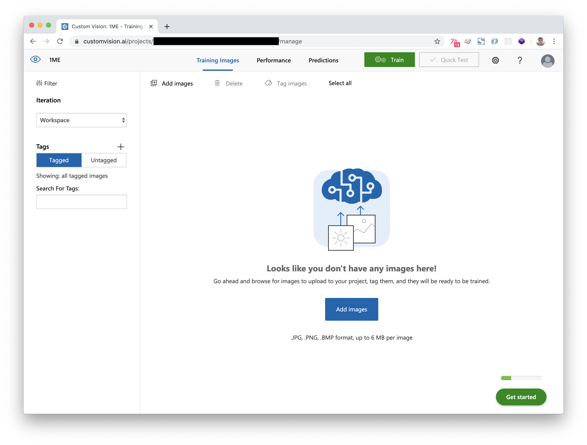
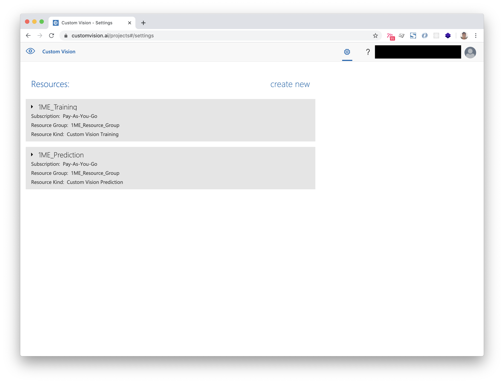
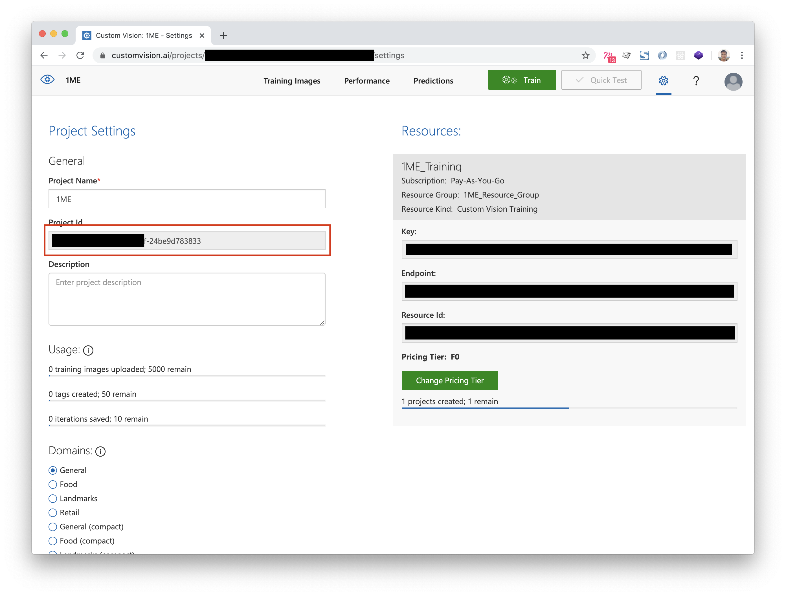

# One Minute: Setup, Installation and Customisation

The One Minute Experience allows visitors to read bite-sized stories about the objects they see within the museum. Visitors can read stories by simply scanning an object with their camera. It is also possible to create these stories using a specialised story editor tool: allowing anyone to create accessible, yet engaging stories about the objects in your museum.

## The One Minute Project

The One Minute project consists of four parts.

- [The One Minute Experience Mobile App](https://github.com/twray/One-Minute-Experience-Mobile-App).
- [The One Minute Experience Story Editor](https://github.com/twray/One-Minute-Experience-Story-Editor)
- A web server running the [Directus Headless CMS](https://directus.io/) with the [One Minute Experience Extension](https://github.com/xmacex/OneMinuteExperienceApiV2) installed.
- A [Microsoft Azure CustomVision Account](https://www.customvision.ai/) with an active Multi-class Classification project, with active API keys for both training and prediction.

This guide will detail how you can set up, install and customise One Minute for your museum.

## Set Up Your CustomVision Account and Get Your API Keys

One Minute uses Microsoft's CustomVision service to perform its image recognition capabilities. In order to setup One Minute for your museum, you will first need to create and configure a CustomVision account. You will then need to obtain a set of API keys so you can connect the Mobile App and Story Editor to this account.

### Create a CustomVision Account

Microsoft offers free and paid subscriptions for this service. The free service allows you to store a limited number of artworks, although if you wish to try or demonstrate the tool on a relatively small collection, the free service is sufficient. The paid subscription offers much more generous capacity in terms of how many images are stored, and the amount of transactions that the system allows.

You can [view pricing information and the differences between a free and a paid CustomVision account](https://azure.microsoft.com/en-us/pricing/details/cognitive-services/custom-vision-service/).

In the following steps. We will set up a free CustomVision account, and create a CustomVision project. We will then later 'link' this project to the One Minute Story Editor and Visitor App. If you wish to do so, you can always upgrade this account to a paid account at a later point.

1. Go to the [Microsoft CustomVision home page](https://www.customvision.ai/).

2. Click on the 'Sign In' link. You'll be prompted to either sign in with an existing Microsoft account, or you will be prompted to create a new one.

3. Once signed in, you may be prompted to create an Microsoft Azure subscription. CustomVision is a service offered by Microsoft Azure, so you would need to sign in or create an Azure account to continue. You will need to add Credit Card information in order to create an Azure account, although you would not be charged anything unless you opt for technical support or a paid subscription.

4. If you were prompted to create an Azure account, go back to [Microsoft CustomVision home page](https://www.customvision.ai/) and click on the 'Sign In' link if it is still present. At this point, you should see a blank 'Projects' screen.



### Create our CustomVision Resources, Projects and API keys

Once you have set up a CustomVision account, you would need to create your *resources*.

Think of a resource as a 'job': something that a service offers. In our case, we would like our CustomVision service to train our images so we can add artworks and stories to the prediction model. Likewise, when a visitor takes a photo with the Visitor App, we would like CustomVision to see if this photo matches any of the artworks we have within the CustomVision model. Hence, we would like CustomVision to 'predict' the image. Since we are asking CustomVision to train and predict images, we would need to create a *training resource* and a *prediction resource*, and assign these two resources to a *resource group*.

1. When logged in to CustomVision and you see the 'Projects' screen, click on the gear icon in the top right corner of the screen.

2. Next to the 'Resources' link, click 'create new'.

3. First we'll create our training resource. Enter a resource name (e.g. `1ME_Training`), select your 'Pay-As-You-Go' subscription,

4. If you haven't done so already, create a Resource Group. Next to 'Resource Group', click 'Add New', and give it a name (e.g. `1ME_Resource_Group`). Select the location that is closest to you.

5. Under the 'Kind' dropdown menu, select `CustomVision.Training`, and select the location that is closest to you.

6. Under the 'Pricing Tier' dropdown, select `F0`. This is the free pricing tier.

Now that we have created our training resource, we will now follow the exact same steps to create our prediction resource.

1. Again, we're going to create a new resource by clicking on the 'create new' link.

2. Enter a resource name (e.g. `1ME_Prediction`), select your 'Pay-As-You-Go' subscription.

3. Select the resource group you have just created.

4. Under the 'Kind' dropdown menu, select `CustomVision.Prediction`, and select the location that is closest to you.

5. Under the 'Pricing Tier' dropdown, select `F0`. This is the free pricing tier.



Click on each box to view more information about each resource. You'll notice that both of our training and prediction resources have a set of keys associated with them. Namely, each resource has a **Key**, **Endpoint** and **Resource Id**.

We'll need to note down this information, as we will need these keys to 'connect' the One Minute Story Editor and Visitor App to the CustomVision service.

If it is not expanded already, click on the training resource box to expand it.

Now create a text file `keys.txt`, and copy and paste the **Key**, **Endpoint** and **Resource Id** listings into the file as follows:

```
TRAINING_KEY=[your-training-key]
TRAINING_ENDPOINT=[your-training-endpoint]
TRAINING_RESOURCE_ID=[your-training-resource-id]
```

Of course, replace `[your-training-key]`, `[your-training-endpoint]` and `[your-training-resource-id]` with the actual values within the grey boxes under the **Key**, **Endpoint** and **Resource Id** headings, respectively.

Now we'll do the same and note down our keys for the prediction resource. If you haven't done so already, expand the information box for the prediction resource and note down its **Key**, **Endpoint** and **Resource Id** in the following format. Add these entries to your `keys.txt` file.

```
PREDICTION_KEY=[your-prediction-key]
PREDICTION_ENDPOINT=[your-prediction-endpoint]
PREDICTION_RESOURCE_ID=[your-prediction-resource-id]
```

Save your `keys.txt` file.

We now have our training and prediction resources ready, and we also have the necessary keys to connect One Minute to these resources. The final step is to now create a *project*.

Within the context of CustomVision, a *project* represents a single image prediction model, with its own set of images. In essence, a CustomVision project is where the images are actually stored. If you are a large organisation with multiple collections, you would typically setup one project per collection.

In order for One Minute to work, you will need at least one CustomVision project. Let's set up a project now.

1. Click on the 'Eye' icon in the top-left corner to navigate back to the Projects page.

2. Click on 'New Project'.

3. Enter a project name (e.g. `1ME`). You can optionally enter a description. Your training resource should be automatically selected. If not, you will either need to manually select it in the dropdown, or you will need to click on the 'create new' link and follow the above steps to create a training resource.

4. For the 'Project Types' option, select 'Classification'.

5. For the 'Classification Types' option, select 'Multiclass'.

6. For the 'Domains' option, select 'General'.

7. Once done, click on 'Create Project'.

You've now created a CustomVision project. Once you have navigated into the project, you should be presented with a screen that looks something like this.


This project represents the container that will store our images and prediction model. Within this project, click on the gear icon located at the top-right corner of the screen. You should come to a screen that looks like this:



On the left-hand side of this screen, there is a **Project Id** field. Copy the text from this field, and add it to our `keys.txt` file:

```

PROJECT_ID=[your-project-id]

```

We have now set up our CustomVision account and have created our resources and projects. We have now extracted everything we need to 'connect' One Minute to CustomVision. The following is an anonymised sample of what your `keys.txt` file could look like.

```

TRAINING_KEY=xxxxxxxxxxxxxxxxxxxxxxxxxxx7d249
TRAINING_ENDPOINT=https://xxxxxxxxxxx.api.cognitive.microsoft.com/
TRAINING_RESOURCE_ID=/subscriptions/xxxxxxxx-xxxx-xxxx-xxxx-a897a03b5efd/resourceGroups/1ME_Resource_Group/providers/Microsoft.CognitiveServices/accounts/1ME_Training

PREDICTION_KEY=xxxxxxxxxxxxxxxxxxxxxxxxxxxd0478
PREDICTION_ENDPOINT=https://xxxxxxxxxxx.api.cognitive.microsoft.com/
PREDICTION_RESOURCE_ID=/subscriptions/xxxxxxxx-xxxx-xxxx-xxxx-a897a03b5efd/resourceGroups/1ME_Resource_Group/providers/Microsoft.CognitiveServices/accounts/1ME_Prediction

PROJECT_ID=xxxxxxxx-xxxx-xxxx-xxxx-xxxxxxxx3833

```

Note that in the above sample, some of the keys and IDs are blanked out. This is intentional - your `keys.txt` file will look different. If your `keys.txt` resembles the above sample, then you are ready to move on to the next step.
